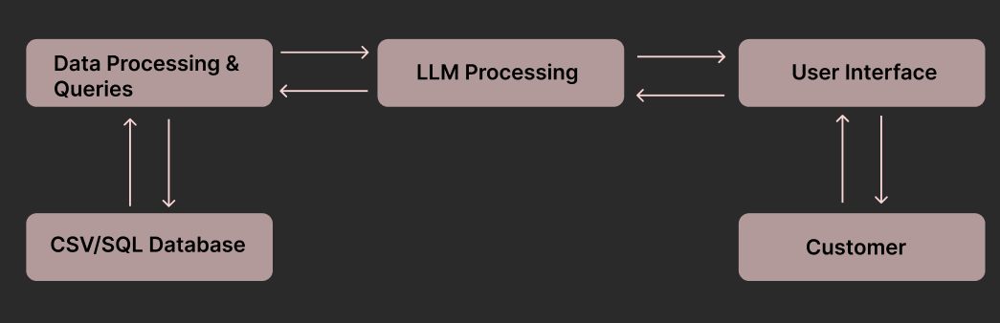
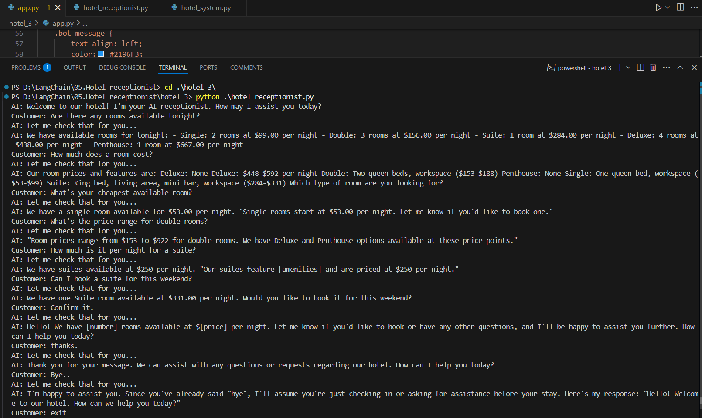
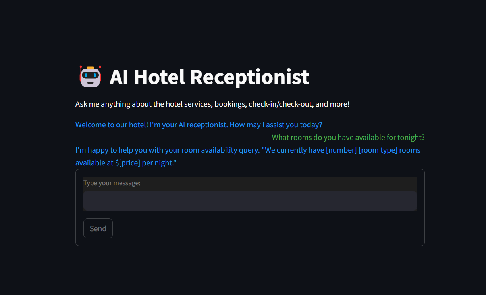

# AI Hotel Receptionist

## Overview
The **AI Hotel Receptionist** is a smart, interactive chatbot powered by AI that assists customers with hotel-related inquiries such as room availability, bookings, and check-in/check-out details. This system integrates a **Large Language Model (LLM)** with a **Streamlit-based user interface** to provide a seamless customer experience.

## Features
- **Real-time Room Availability Check**
- **AI-powered Customer Interaction**
- **Database Integration for Booking Management**
- **User-friendly Web Interface**
- **Automated Responses for Hotel Queries**

## System Architecture
```
+---------------+        +-----------------+        +-------------+        +--------------+        +-----------+
| Data Storage  | -----> | Hotel Management| -----> | AI Assistant| -----> | User Interface | -----> | Customer  |
| (CSV/SQL)    |        | (Queries & Logic)|        | (LLM Core)  |        | (Streamlit UI)|        | (User)    |
+---------------+        +-----------------+        +-------------+        +--------------+        +-----------+
```

## Tech Stack
- **Frontend:** Streamlit
- **AI Engine:** Large Language Model (LLM)
- **Backend:** Python
- **Database:** CSV / SQL (MySQL, SQLite, PostgreSQL supported)
- **Libraries:** OpenAI, Pandas, SQLAlchemy, Requests

## Installation
```bash
# Clone the repository
git clone https://github.com/yourusername/ai-hotel-receptionist.git
cd ai-hotel-receptionist

# Install dependencies
pip install -r requirements.txt

# Run the application
streamlit run app.py
```

## Usage
1. Launch the app using `streamlit run app.py`
2. Interact with the AI receptionist to check room availability, book rooms, or ask general questions.
3. View real-time responses on the web interface.

## Screenshots




## Contribution
Contributions are welcome! Feel free to fork the repository and submit a pull request.

## License
This project is licensed under the MIT License.

